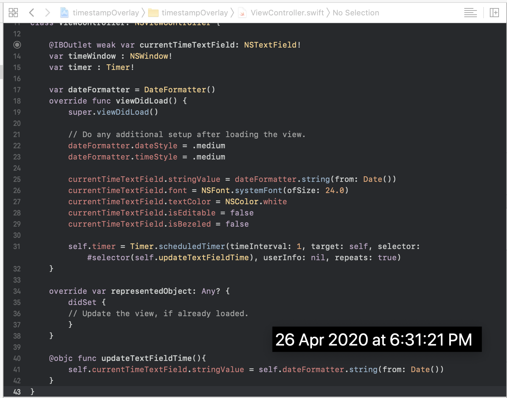

# timestampOverlay

The app will show the current time (according to your system time setting format) in a floating window on your screen, you can drag it anywhere.

Helpful for taking screenshot with timestamp, for legal purposes.

